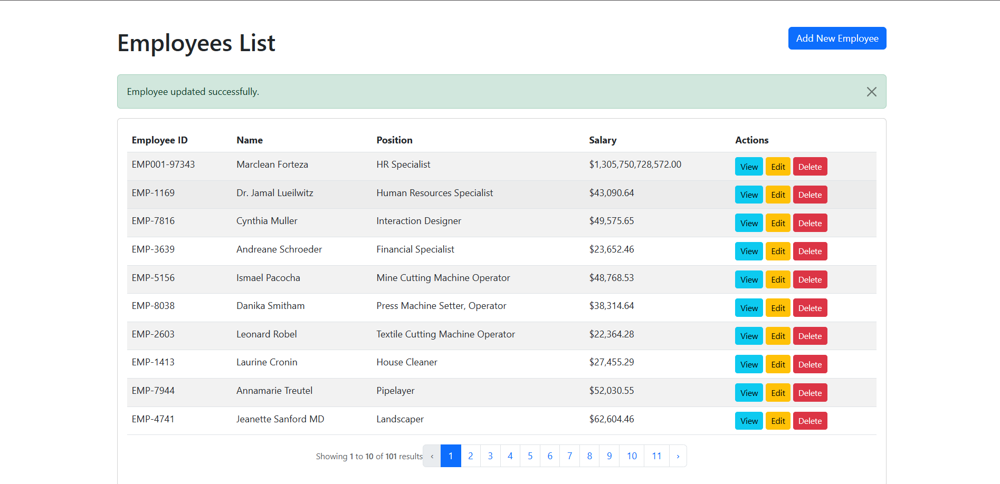

# Employee Management System

This project is converted from a Student Management System into an Employee Management System using Laravel CRUD. It features a complete management interface for handling staff records efficiently.

## 📊 Database Fields
- **id**: Primary Key
- **employee_id**: Unique Identifier (e.g., EMP-1234)
- **name**: Full name of the employee
- **email**: Unique professional email address
- **position**: Job role (Software Engineer, Project Manager, etc.)
- **salary**: Monthly compensation
- **created_at / updated_at**: Timestamps

## ✨ Features
- **Full CRUD**: Add, View, Update, and Delete employees.
- **Latest-First Sorting**: Newly added employees automatically appear at the top.
- **Pagination**: Organized list showing 10 employees per page.
- **Data Seeding**: Instant generation of 200 sample records for testing.
- **Dropdown Selection**: Standardized positions for data consistency.

## 📸 Screenshot


---

## 🚀 How to Clone and Setup

Follow these steps to run the project on your local machine:

### 1. Clone the Repository
```bash
- git clone [](https://github.com/mrcln2/employee-management-system.git)
- cd employee-management-system
- composer install
- cp .env.example .env
- php artisan key:generate
- php artisan migrate:fresh --seed
- php artisan serve
- Access the app at: http://127.0.0.1:8000